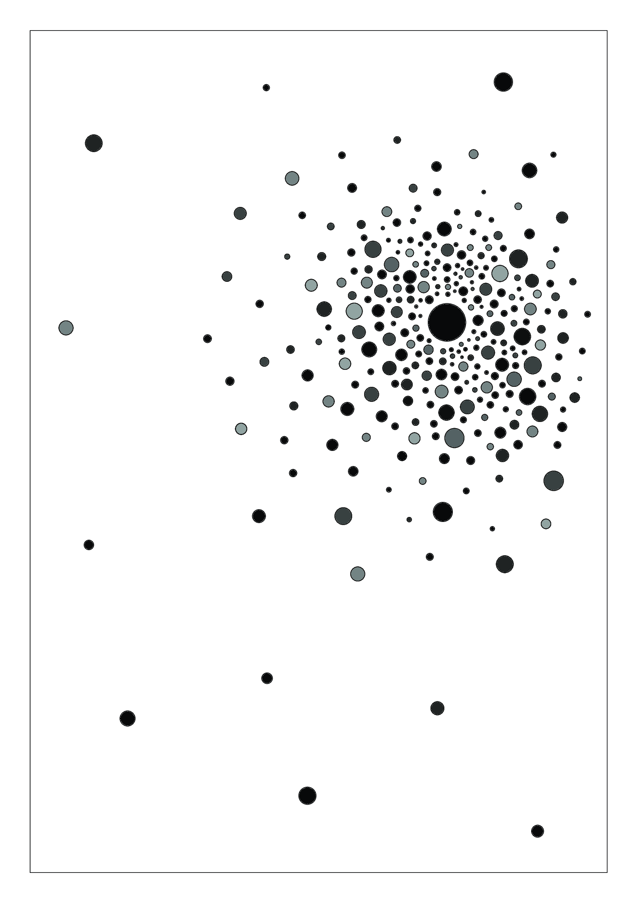

# Композиции 

## Динамика

### Вниз. Родственные контрастные цвета

### Влево вниз. Родственные цвета

### Вправо. Ахроматические цвета

### Вправо вверх. Родственные цвета

## Статика

### Статика. Пастельные цвета 

## Композиционный центр

### Пауза. Дополнительные цвета

### Размер. Монохромные цвета

### Сгущение. Ахроматические цвета

### Форма. Пастельные цвета

### Цвет. Родственные и контрастные цвета
