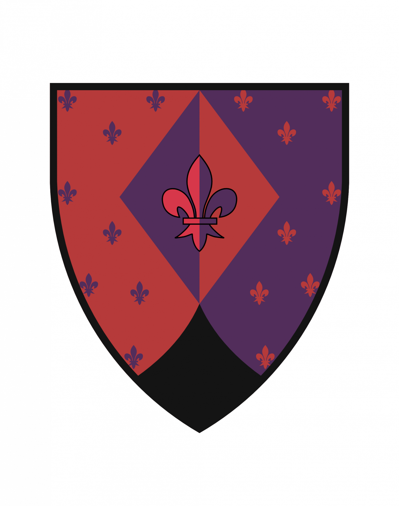

# Фамильный герб 

Форма
- Форма: Треугольный остроконечный (норманский)
- Внутри гербового щита находится ромб. Он придает гербу симметрию и баланс

Символ: 
- Используется геральдическая лилия (флер-де-лис). Геральдическая лилия означает цветение и процветания триединства тела, ума и души человека.

Цвета (подбирались путем опроса семьи):

- Красный цвет: Красный цвет в гербе означает смелость, отвагу, любовь.
- Черный цвет: Черный цвет в нашем гербе означает тайну, защиту и оборону (поскольку он обрамляет весь герб и как бы его защищает).
- Пурпурный цвет: Пурпурный цвет в гербе означает элегантность, изысканность и достоинство.

## Герб 

