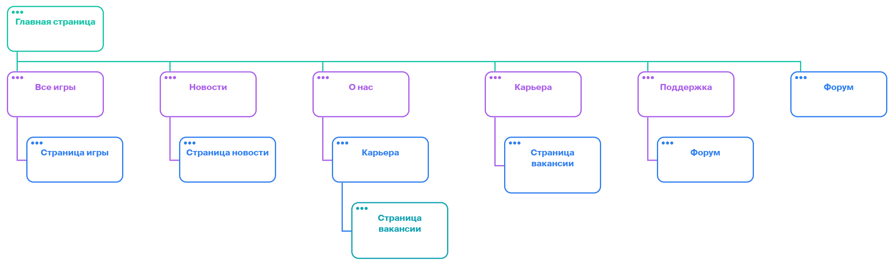

# Проект сайта игровой компании

## Цели 

Цели сайта игровой компании такие, как:
- Привлечение новых покупателей;
- Продвижение своих игр;
- Продажа игр и других товаров;
- Предоставление поддержки;
- Сбор обратной связи;
- Привлечение талантливых сотрудников для работы в компании;
- Расширения сообщества;
- Развитие компании;
- Улучшение удовлетворенности аудитории.

## Контекст

### Целевая аудитория

> Целевая аудитория сайта игровой компании - это люди, интересующиеся видеоиграми и, в частности, играми этой компании. Также аудитория сайта включает в себя людей, которые интересуются непосредственно самой игровой компанией (новости компании, вакансии, форум и т.д.)
> 

#### Основные потребности целевой аудитории могут включать:

- Просмотр информации о компании;
- Просмотр информации об играх;
- Покупка игр;
- Получение ответов на вопросы;
- Взаимодействие с другими пользователями и командой игровой компании;
- Поддержка и помощь в случае наличий проблем;
- Желание посмотреть вакансии для работы в компании.

#### Способы взаимодействия с целевой аудиторией:

- **Наличие информации об играх.** На сайте есть подробная информация об играх, выпущенных компанией, а также присутствует возможность их приобретения;
- **Наличие форума для пользователей**, где они могут общаться между собой и с командой разработчиков игровой компании. Это создает прямой канал связи между компанией и целевой аудиторией, позволив игрокам выразить свои мнения, идеи и пожелания;
- **Наличие службы поддержки.** Сайт предоставляет возможность пользователям обращаться в поддержку для решения различных вопросов, а также оставлять отзывы и комментарии;
- **Регулярные обновления и новости.** На сайте регулярно обновляются новости об играх, обновлениях, дополнениях к играм и других изменениях. Также на сайте обновляются новости о самой компании. Новости позволяют держать аудиторию в курсе последних событий;
- **Наличие предложений о работе.** Сайт предоставляет возможность просматривать информацию о вакансиях и предложений о работе в компании. Это помогает привлечь талантливых и преданных сотрудников, которые будут работать на достижение общих целей игровой компании.

<aside>
👥 Учитывая потребности целевой аудитории, сайт игровой компании должен предоставлять полезную и актуальную информацию, легкодоступную навигацию и интерактивные функции, позволяющие пользователям общаться между собой и с разработчиками.

</aside>

### Конкуренты

> Конкуренты сайта игровой компании - сайты других игровых компаний и студий.
> 

#### Список некоторых конкурентов:

- **Mundfish** - российская игровая компания. Она специализируются на разработке игр с уникальным сеттингом, сильным фокусом на сюжетной линии и атмосфере. Их крупным проектом является игра “Atomic Heart”. Имеет строгий, стильный и интересный сайт, который отлично отражает их игру;
- **Electronic Arts (EA)** - американская игровая компания, которая производит игры для разных платформ, включая ПК, консоли и мобильные устройства. Они специализируются на разных жанрах, включая спортивные игры, шутеры и ролевые игры. Пример игр: “Battlefield”, “The Sims”, “Need for Speed” и другие. Сайт EA является очень информативным, но он также имеет удобный интерфейс для покупки и загрузки игр. Однако, некоторые пользователи могут найти сайт немного запутанным и перегруженным информацией;
- **Ubisoft** - французская игровая компания, специализирующаяся на разработке и издании компьютерных игр. Пример игр: “Assassin’s Creed”, “Far Cry”, “Watch Dogs” и другие. На их сайте легко найти информацию об их играх, а также о студиях и команде разработчиков. Ещё их сайт предоставляет доступ к эксклюзивному контенту и материалам для своих игроков;
- **Rockstar Games** – американская игровая компания, известная своими крупными и популярными франшизами, такими как “Grand Theft Auto”, “Red Dead Redemption” и “Max Payne”. Владельцем Rockstar Games является корпорация Take-Two Interactive. Имеет очень профессиональный и хорошо разработанный сайт, который отражает стиль и атмосферу их игр. На сайте легко найти информацию о новых и будущих играх, акциях и событиях, а также скачать обои, заставки и другие материалы по играм;
- **CD PROJEKT RED** - польская игровая компания по разработке видеоигр, специализирующаяся на изобретательности повествования, технических инновациях и абсолютном качестве. Известна играми “The Witcher 3: Wild Hunt”, “Cyberpunk 2077”. Имеет очень хороший сайт с множеством информации о их играх и обновлениях, а также о команде разработчиков. На сайте есть форумы и возможность получить помощь в технических вопросах.

### Влияние и тенденции

#### Факторы влияния:

- **Продукты**. Ключевым фактором влияния сайта игровой компании является продукция. Сайт служит важным каналом для информирования о новых и грядущих играх, а также для предоставления информации о компании вышедших играх, мероприятиях и так далее. Качество и популярность продуктов компании также имеют важное влияние на общественное мнение о сайте и компании в целом;
- **Сообщество**. Сайт придает большое значение общению с игроками и сообществом. На сайте предоставляются возможности для общения с разработчиками и другими игроками, а также для получения обратной связи от пользователей. Это помогает укреплять связь между компанией и ее клиентами;
- **Маркетинг**. сайт в качестве инструмента маркетинга. На сайте представлены трейлеры, рекламные материалы и другие промо-материалы, которые позволяют привлекать внимание к новым играм, а также к самой компании;
- **Дизайн и функциональность.** Дизайн и функциональность оказывают большое влияние на восприятие компании. Удобный и функциональный сайт может привлекать больше пользователей и создавать более приятное отношение к компании;
- **Конкуренция.** Конкуренция в игровой индустрии может сильно влиять на сайт игровой компании. Чтобы привлечь и удержать пользователей, сайт должен запоминаться, а для этого он должен быть удобным и выглядеть соответствующе;
- **Обратная связь от пользователей.** Обратная связь от пользователей может сильно влиять на развитие сайта. Пользователи могут предлагать идеи, указывать на проблемы и давать рекомендации, которые могут помочь компании улучшить свой сайт.

#### Общие тенденции:

- **Удобство использования**. Сайт должен быть удобным в использовании, чтобы пользователи могли легко найти нужную им информацию, а также легко производить покупки;
- **Адаптивность.** Сайт должен адаптироваться под различные устройства, чтобы пользователи могли легко получать доступ к сайту и пользоваться всеми его функциями с любого устройства;
- **Безопасность.** сайт игровой компании обязательно должен быть безопасным. Сайт должен использовать лучшие методы защиты данных и обеспечивать безопасность своих пользователей;
- **Внимание к сообществу.** Сайт игровой компании должен придавать большое значение общению с сообществом и обратной связи от пользователей. На сайте представлены форум, новости, блог и служба поддержки, которые позволяют игрокам общаться друг с другом и с разработчиками;
- **Развитие бренда.** Сайт игровой компании играет важную роль в развитии бренда, так как сайт напрямую представляет информацию о компании, что позволяет привлекать новых игроков и укреплять лояльность существующих.

### Ограничения

- **Возрастные ограничения.** Сайт должен иметь возрастные ограничения. В зависимости от типа игр, которые представлены на сайте, могут быть установлены различные возрастные ограничения;
- **Ограничения контента.** Сайт может иметь ограничения на контент, который доступен пользователям. Это может включать запрет на контент, который содержит насилие и другие нежелательные материалы;
- **Ограничения на доступность.** Сайт может иметь ограничения на доступность в определенных странах или регионах, в зависимости от законодательства и других правил, которые могут применяться к игровой компании;
- **Ограничения на использование личной информации.** Сайт имеет политику конфиденциальности, которая определяет, какая личная информация пользователей может быть собрана, использована и передана третьим лицам. Сайт также может иметь ограничения на сбор и использование информации о несовершеннолетних пользователях;
- **Ограничения на использование нарушающих права материалов.** Сайт может иметь ограничения на использование материалов, которые нарушают авторские права или другие интеллектуальные права. Это может включать запрет на использование не своих игр или других материалов.

## Концепция

> Сайт игровой компании работает как инструмент для продвижения, продажи своих продуктов, предоставления информации, взаимодействия с пользователями, сбора обратной связи и привлечения сотрудников. Он имеет множество разделов: новости, форум, поддержка, каталог игр, список вакансий и т.д.
> 

> Сайт игровой компании монетизируется путем продажи своих игр. Также можно зарабатывать деньги на сотрудничестве с другими компаниями. *Однако, важным аспектом является то, что сайт больше служит для взаимодействия с пользователями, привлечения новых пользователей, привлечения сотрудников для работы в компании и продвижения продуктов компании.*
> 

### Отличительные особенности сайта:

- Сильный фокус на сообществе. Сайт игровой компании предоставляет возможность пользователям общаться между собой и с разработчиками, а также принимать участие в различных мероприятиях, таких как конкурсы и опросы;
- Наличие обширной информации об игровых продуктах. На сайте присутствует полная информация об играх и их дополнениях. Сайт позволяет ознакомиться с описанием игры, её историей, лором, персонажами, концепт-артами и т.д. Также на сайте можно приобрести игры и дополнительный контент;
- Привлекательный дизайн сайта и хорошая адаптивность. Сайт игровой компании имеет очень качественный и понятный дизайн, который отражает стиль компании и её игр. Он легко читаемый и имеет простую навигация, что делает его простым и приятным в пользовании;
- Наличие интерактивности. Игры - это развлечение, и сайт должен отражать эту концепцию. Для этого на сайте есть несколько интерактивных элементов, которые позволяют пользователям получить более интересный опыт изучения информации об играх компании;
- Открытость компании к пользователям. Сайт игровой компании должен быть открыт для своей аудитории. Поэтому на сайте есть последние новости о компании, мероприятиях, разработках игр и дополнений к ним, форум и прочее.

### Рекомендации к развитию и поддержке сайта после его запуска:

- Регулярно обновлять контент сайта. Сайт игровой компании должен регулярно обновлять свой контент (например, новые игры, дополнения, последние новости компании). Это поможет привлечь пользователей на сайт и удержать их внимание;
- Сайт должен быть адаптирован под все устройства;
- Всегда поддерживать взаимодействие между пользователями;
- Регулярное проведение опросов и исследований для сбора мнений пользователей о сайте и играх компании;
- Всегда поддерживать систему обратной связи, чтобы пользователи могли связаться с командой поддержки и получить помощь при наличии проблем. Это поможет удерживать пользователей на сайте и показать, что компания ценит своих клиентов. А также это может указать на слабые места, которые нужно исправить.

## Функциональные возможности

## Сайт игровой компании предоставляет следующие функциональные возможности:

- **Наличие информации о компании, её играх и проектах.** На сайте можно ознакомиться с подробной информацией о компании, ее истории и проектах, которые она выпустила или разрабатывает;
- **Наличие новостей и блога.** На сайте можно следить за новостями о компании, мероприятиях, играх и т.д. Это позволяет пользователям быть в курсе последних событий. Также на сайте есть блог, где разработчики компании публикуют свои мысли и идеи.
- **Каталог игр.** На сайте есть каталог игр (и дополнений к ним), выпущенных игровой компанией. Каждая игра сопровождается подробным описанием, её историей, лором, персонажами, концепт-артами, скриншотами и видеороликами, чтобы пользователи могли лучше ознакомиться с игрой и принять решение о покупке. Также на сайте можно приобрести игры и DLC;
- **Форум.** На сайте есть форум, где пользователи могут общаться между собой и командой игровой компании, делиться своим опытом, обсуждать что-либо и задавать вопросы;
- **Служба поддержки.** На сайте есть раздел поддержки, где пользователи могут задавать интересующие их вопросы и ответы на вопросы и помощь в решении возникших проблем;
- **Вакансии.** На сайте есть раздел с вакансиями в игровой компании. Пользователи могут найти подробную информацию о доступных вакансиях и отправить резюме для рассмотрения;
- **Локализация**. Сайт предоставляет возможность изменить язык.

## Фирменный стиль

> Фирменный стиль сайта игровой компании обязательно должен быть согласован с общей концепцией компании и соответствовать ее целям и целевой аудитории.
> 

## Фирменный стиль сайта игровой компании имеет следующие характеристики:

- Логотип игровой компании представляет из себя чертенка на фоне фирменного светло-зеленого цвета, под названием “зимне-зеленая мечта” (данный цвет активно используется на элементах сайта). Логотип хорошо виден на сайте и на каждой странице, чтобы усилить узнаваемость бренда.
- Шрифты, используемые на сайте:
    - Vintage Queens (шрифт, используемый в названии логотипа) ;
    - Montserrat (основной шрифт сайта).
- Цветовая гамма сайта представляет из себя темные оттенки с добавлением фирменного  светло-зеленого цвета, под названием “зимне-зеленая мечта”. ;
- Основной стиль сайта - строгий минимализм с элементами светло-зеленого цвета;
- Кнопки на сайте имеют минималистический дизайн с добавлением фирменного светло-зеленого цвета.

## Структура

